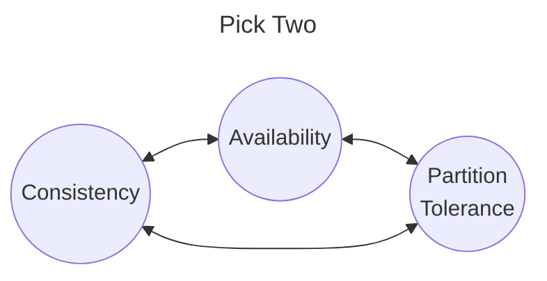
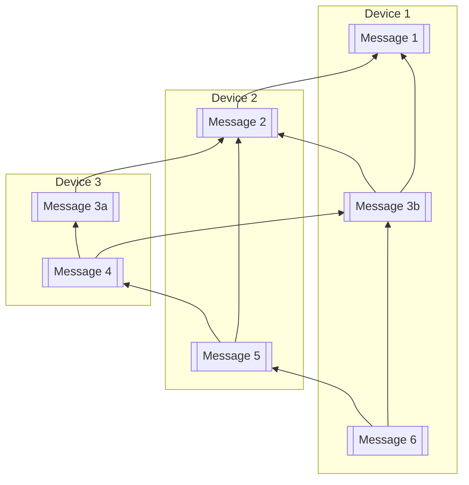

# Finder (0xA9F4)

Finder is a protocol for asynchronous messaging in a fully decentralized context. It is intended to be used to build messaging and message board applications that an scale down to run on embedded devices. Although the core design is not tied to any preticular networking technology the initial implementation focuses on ESPNow which is a preparatory IoT wireless protocol. It was chosen based on it's rance ~500m line of site, and megabit speeds. Where choosing a priority protocol is not ideal it is outwaited by the ubiquity of low cost dev boards that can be acquired for between $5-$10 USD (as of 2024).

> ## Why Async?
>
> There have been many attempts in the past to build community wireless networks but none have seemed to gain traction with the communities they aim to serve. This is likely due to the fact that adhoc networks or other approaches that don't invest large amounts of money and time in to infrastructure will tend to have intermittent links and network splits. Modern internet protocols such as TCP and HTTP do not work well (or at all) in such environments leading to frustrated users and lack of adoption. If instead we use a async modal for our base protocols applications can work reliably even network access is only periodic. We believe this ability to operate opportunistically will solve the user experience issues that plage past attempts at community networking.

The protocol is composed of NNN main components:

- Messaging data modal
- User onboarding
- User management
- Data Syncing

## Messaging modal

Messaging in Finder happens in channels. A channel is a async multi reader multi writer message buss much like a RabbitMQ topic. Finder differs from other message buss protocols in that it choses to optimizes availability and partition tolerance over strong global consistency.

### Consistency

Finder uses a relaxed ordering model in which not all nodes will order all message consistently. Instead we offer the weaker granites:

- All messages from a single sender will be consistently ordered at every node that receives them.
- Given a message `M_n` sent from a device `D1`. Any device `D2` that receives `M_n` can trivially detect if they did not receive any prior.
- If a message `M2` is in response to some other `M1` then a well behaved device `D1` will send `M1` before `M2` to any other device that it communicates with. (Assuming that both `M1` and `M2` where retained.)

These three properties result it partial orders such as the fallowing:

In this example each message points to the the previous message from the same device as well as the one it was in reply to. There are a number of orderings for this graph:

| Device   | Consistent | Inconsistent | Remainder |
| :---     | :---:      | :---:        | :---:     |
| Device 1 | 1, 2       | 3b, 3a       | 4, 5, 6   |
| Device 2a| 1, 2       | 3a, 3b       | 4, 5, (6) |
| Device 2b| 1, 2       | 3b, 3a       | 4, 5, (6) |
| Device 3 | 1, 2       | 3a, 3b       | 4, (5, 6) |

(*Messages in `()` are ones which might or might not have been see by a device*)

Ignoring messages which might not hav been received we see two distinct orderings. Device 1 and 3 will see `3a` and `3b` in different orderings, where device 2 might see either ordering depending on which of the other devices it syncs with first.

For all devices it is possible to detect when inconsistent orderings exist and display adjust the display of messages in a manner that minimizes confusion to users.

### Availability

Data is **stored locally** so that both messages seen in the past can be accessed even offline and new and new messages can be sent even when off line. This provides 100% availability for writes, as well as for any past messages that have been retained.

### Partition Tolerance

Unlike most messages busses there is no central broker to provide ordering and store and forward messaging. Instead all devices pertisipating in a channel retain any messages they have seen as storage allows. This way when two devices have an opportunity to communicate they exchange messages filling in any gaps in history they may have.

