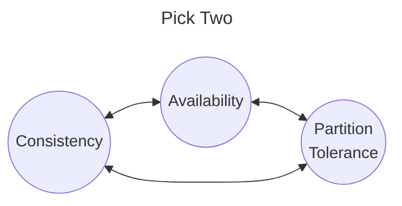
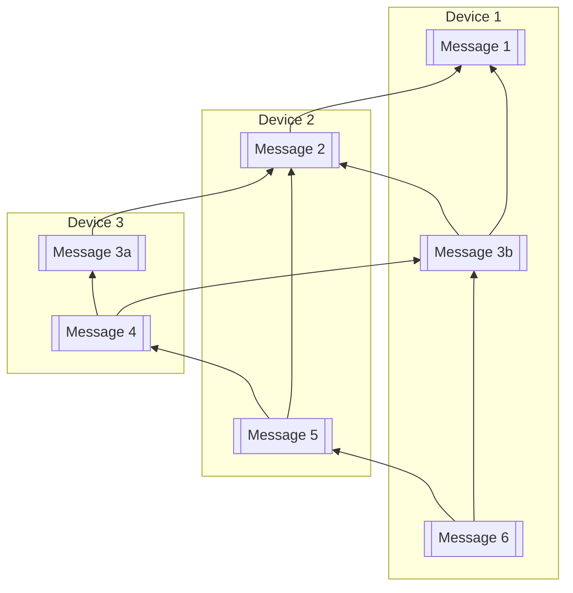

# Finder (0xA9F4)

Finder is a protocol for asynchronous messaging in fully decentralized contexts. It is intended to be used for messaging and message board applications. In addition protocol can scale down to run on embedded devices powered by microcontrollers allowing for deployment one cheep devices that are accessible and hackable.

 Although the core design is not tied to any particular networking technology the initial implementation focuses on ESPNow which is a preparatory IoT wireless protocol on the ESP32 family of microcontrollers. ESPNow was chosen based on it's range, ~500m line of site, and megabit speeds. Where choosing a priority protocol is not ideal it is outwaited by the ubiquity of low cost dev boards that can be acquired for between $5-$10 USD (as of 2024).

> ## Why Async?
>
> There have been many attempts in the past to build community wireless networks but none have seemed to gain traction. This is likely due to the fact that adhoc networks tend to have intermittent links and network splits. This will be true of any approach that doesn't invest large amounts of money and time in to infrastructure.
>
>Modern internet protocols such as TCP and HTTP do not work well (or at all) in environments lacking high availability networking, leading to frustrated users and lack of adoption. 
>
>If instead network protocols use an async modal applications can work reliably even when network access is only periodic.
>
>We believe the ability to operate opportunistically will solve the user experience issues that plage past attempts at community networks.

The protocol is composed of five main components:

- Messaging data modal
- User onboarding
- User management
- Data Syncing
- Data Retention

## Messaging modal

Messaging in Finder happens in channels. A channel is a async, multi reader, multi writer, message buss much like [AMQP](https://en.wikipedia.org/wiki/Advanced_Message_Queuing_Protocol).

 Finder differs from other message buss protocols in that it choses to optimizes availability and partition tolerance over strong global consistency. (See [CAP](https://en.wikipedia.org/wiki/CAP_theorem))

### Consistency

Finder uses a relaxed ordering model in which not all devices will order all message consistently. Instead Finder offers the weaker granites:

- All messages from a single sender will be consistently ordered at every device which receives them.

- Given a message `M_n` sent from a device `D1`. Any device `D2` that receives `M_n` can trivially detect if any prior message was not received.

- If a message `M2` is in response to some other `M1`, then a well behaved device `D1` will send `M1` before `M2` to other devices. (Assuming that both `M1` was retained by `D1`.)

These three properties result it partial orders such as the fallowing:

In this example each message points to the the previous message from the same device as well as  one it was in reply to. 

There are a number of orderings given this graph:

| Device   | Consistent | Inconsistent | Remainder |
| :---     | :---:      | :---:        | :---:     |
| Device 1 | 1, 2       | 3b, 3a       | 4, 5, 6   |
| Device 2a| 1, 2       | 3a, 3b       | 4, 5, (6) |
| Device 2b| 1, 2       | 3b, 3a       | 4, 5, (6) |
| Device 3 | 1, 2       | 3a, 3b       | 4, (5, 6) |

(*Messages in `()` are ones which might or might not have been see by a device*)

Ignoring messages which might not hav been received we see two distinct orderings. Device 1 and 3 will see `3a` and `3b` in different orderings. Device 2 might see either ordering depending on which of the other devices it communicates with first.

For all devices it is possible to detect when inconsistent orderings exist and adjust the display of messages in a manner that minimizes confusion to users.

### Availability

Data is **stored locally** on devices. This provides 100% availability for writes, as well as for reads of any past messages that have been retained.

New messages from other devices will be received as soon as a device is able to communicate with **any other** device which has retained them.

 There is no requirement in the protocol for coordinating nodes or centralized infrastructure.

### Partition Tolerance

Unlike most messages busses there is no central broker to provide ordering or store and forward messaging. Instead all devices participating in a channel retain any messages which have seen as long storage limits allow.

When two devices have an opportunity to communicate they exchange messages filling in any gaps in history they may have.

## User Onboarding

During onboarding two things must happen:

- The new user must learn the id of the channel.
- The onboarding admin must lear the public key of the new user.

This will be achieved by the admin broadcasting an invitation which includes the channel id and name. The new user will respond to that invitation with their public key and user name. The response from the new user will be signed with their private key preventing forged responses.

The team name and user name should be used in the UI to ensure that the correct channel and user are added. This is only a weak approach to authentication which could be overcome by a active attacker during onboarding.

> ### Future improvement
>
>In an ideal situation each party will receive the onboarding information in a way that is authenticated. If the exchange is authenticated no nearby adversary can trick the the new user into joining the wrong channel or the admin from onboarding the wrong user.
>
>The user experience challenge in authenticating this exchange is both the channel id and user pubic key are tens of bytes long and are effectively random numbers. This makes each hard to enter manually in to a device. In some cases QR codes can be used to bootstrap the process but not all targeted devices will have cameras.
>
>This mutual authentication can achieved with an excellent user experience using a [Balanced PAKE](https://en.wikipedia.org/wiki/Password-authenticated_key_agreement). This only works when preformed in an online setting. An example of how this abroach might work can be seen in [WebWormhole](https://webwormhole.io/) which uses PAKE to alow easy and secure sharing of files.
>
>Another abroach is to use a long pass phrase of around eleven words. Using eleven or more words in a pass phrase with a large dictionary can provide greater 100 bits of security. This security is achieved without the need of a zero knowledge proof used in a PAKE.
>
>In addition using a large passphrase with more traditional cryptography will work in a async context.
>
> After an initial implementation is working one or both of these approaches should be adopted.

## User Management

In the initial design of Finder each channel has a single admin who is the user that created the channel. Other users can be made admins but this permission can not be reliably revoked.

Users can be removed but and adversarial implementation of the protocol can avoid the removal in some situations.

## Data Syncing

A device which is in a channel will periodically send out `hello` messages for each channel they have retained. A `hello` message will indicate the most recent messages the sender has received.  Other devices should check to see if they are up to date based on the hello message.

If a device discovers it is not up to date it will request the missing messages from the device which broadcast the `hello`.

Other near by devices may opportunistically process sync messages even if they were not the node that requested them. This could significantly reduce congestion of the radio spectrum.

## Data Retention

Although text messages will be small in size, many of the target devices have only MBs storage. It is expected that if all messages are retained eventually all storage will be consumed. To allow for the continued recept of new messages, older messages will be expunged.

In a given channel the oldest messages will be removed first.

The dropping of old messages creates the possibility that a device might not receive some message before a device it syncs with has dropped them. This will leave a gap in the message history of a device in such a situation. Applications must be tolerant such gaps in history.

If some device dose have a gap in it's message history, it is possible that it may later receive the missing message. This is a case where it will be possible to receive a messages from a device out of order. I am not currently sure the best way to handle this case other than trying to size storage to make it an unlikely occurrence. If this is going to be a rare case one could simply drop out of order messages though this would open up the system to danial of service attacks.